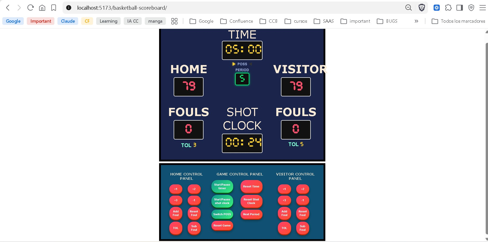

# Basketball Scoreboard

An interactive basketball scoreboard built from scratch with vanilla JavaScript — game clock, shot clock, fouls, automatic bonus, timeouts, possession, and full keyboard support.

**[Live demo](https://artumax9.github.io/basketball-scoreboard/)**



## Features

- **Score, fouls and timeouts** for both teams, with a shared control panel.
- **Automatic bonus**: derived from team fouls, following the real rule — a team enters the bonus at 5 team fouls in the period, no manual toggle involved.
- **Game clock and 24-second shot clock**, both based on real elapsed time (`Date.now()`), so they stay accurate even if the tab is backgrounded or the browser is busy.
- **Period control**: advancing the period resets fouls and the game clock, and automatically switches to a 5-minute overtime clock after regulation (period 5+).
- **Possession arrow**, toggled manually to match the game.
- **Full game reset**, with negative values guarded against (`Math.max(0, ...)`).
- **Persistence**: the game state survives a page reload via `localStorage`.
- **Keyboard shortcuts**: `Space` to start/pause the game clock, `R` to reset the shot clock.
- **Responsive layout** down to mobile widths, and accessibility features (`aria-live` regions, `aria-label`s, `aria-pressed` on toggles, visible focus outlines).

## Technical decisions

This project intentionally uses **no framework**. The goal was to build, by hand, the pattern that React (and most modern frameworks) automates for you — as a deliberate step before learning React itself.

- **A single `state` object as the only source of truth** (`src/state.js`). Every other piece of the app — the DOM, `localStorage`, the clocks — is a reflection of this object, never an independent copy of the same fact. This is the direct fix for a real bug found early in the project: two variables describing "is the clock running?" could get out of sync, and the button needed two clicks to work correctly. Deriving the bonus indicator from fouls (instead of storing it separately) follows the same principle.
- **A single `render()` function** that reads `state` and updates the DOM. Every action mutates `state` and then calls `render()` — the DOM never stores information, only displays it. This is the same split Rails makes between model, controller and view, and it's exactly what React's `useState` + automatic re-render does for you under the hood.
- **Event delegation**: one listener on the control panel reads `data-action` / `data-team` / `data-points` attributes from the clicked button and dispatches to a plain JavaScript object of handler functions, instead of a long `if/else` chain or one listener per button. Adding a new control means adding one line to that object, not touching the listener.
- **Timestamp-based clocks**: `setInterval` doesn't guarantee its interval will fire exactly on time, so both clocks store the real end timestamp (`Date.now() + remaining * 1000`) and recompute the remaining time from elapsed real time on every tick, instead of naively decrementing a counter.
- **ES modules** (`src/state.js`, `src/clock.js`, `src/render.js`, `src/rules.js`, `src/main.js`, `src/storage.js`, `src/sync.js`) instead of one large script with global variables. Each module has its own scope and only exposes what it explicitly exports.
- **Pure functions extracted for anything testable** (`src/rules.js`): time formatting, the bonus rule, and the overtime clock length are plain functions with no side effects, which is what makes them trivial to unit test without a browser or a DOM.

## Running locally

```bash
npm install
npm run dev
```

## Running the tests

```bash
npm test
```

The test suite (`src/rules.test.js`) covers the pure game-logic functions, including a regression test for the original shot clock bug: a `<span>` DOM element was compared directly against a number, so the comparison silently evaluated through `NaN` and always returned `false` — a class of bug this project no longer has, since that logic now lives in a pure, tested function instead of touching the DOM directly.

## Credits

The initial HTML/CSS layout started from a Scrimba exercise. All game logic, the `state` + `render()` architecture, the clocks, persistence, accessibility work, tests, and the CI/CD deployment pipeline were built independently on top of it.
